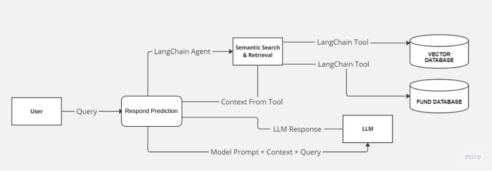
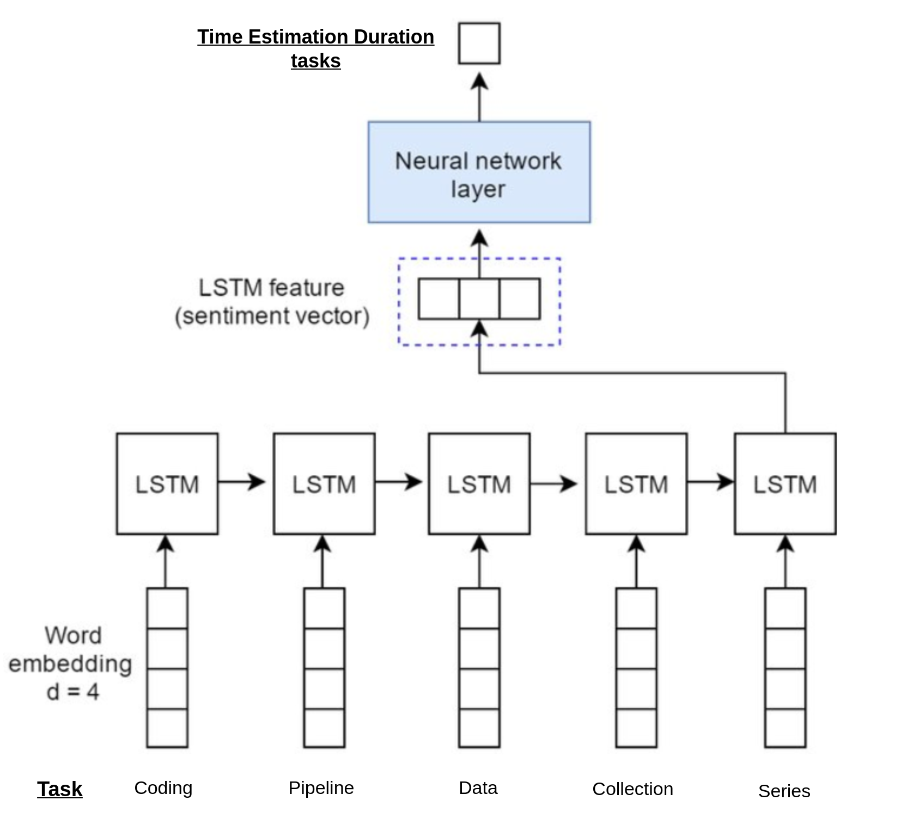
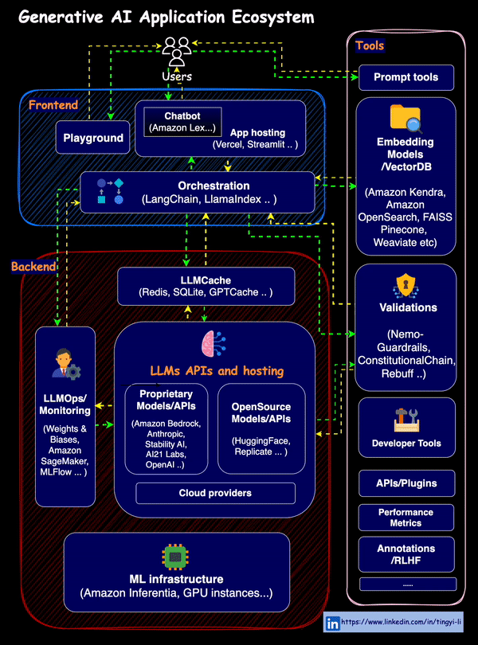

## Alignment Self-Evaluation RAG Personalization System and LTSM Duration Prediction Task

 **The problematic:**

**Objective:** Develop integrated Modeling AI to improve the Creativety and Productive of Team development during Project Building and Split Tasks based on time Duration **a multi-agent system (MAS)** that predicts tasks Plan Schudule of given new Project based on Pervouis Tasks and  their completion times based on project descriptions Task using **LTSM model**. 
The Modeling AI personalizes predictions by considering user-defined The project description to Models And Predicting (Tasks Pipelines - Duration Time of Each tasks) from previous projects.

**Objective:**
 Develop integrated Modeling AI to improve the Creativety and Productive of Team development during Project Building and Split Tasks
based on time Duration a multi-agent system (MAS) that predicts tasks Plan Schudule of given new Project based on Pervouis Tasks and their
completion times based on project descriptions Task using LTSM model. The Modeling AI personalizes predictions by considering user-defined
The project description to Models And Predicting (Tasks Pipelines - Duration Time of Each tasks) from previous projects.


### Run the Application with Shell Script 

1. Run the shell script to install the required packages and libraries:

```bash
sudo chmod +x run.sh && ./run.sh
```
2. run to server Ollama Open Source Model 

```bash 
sudo chmod +x Ollama.sh && ./Ollama.sh
```

3. Run the application Direclty with Shell Following 

```bash 
sudo chmod +x app.sh && ./app.sh
```
## Project Plan Steps :

1. **Data Collection and Preprocessing:** Gather historical project data (task descriptions, pipelines, durations)  and prepare it for LSTM model training.

2. **LSTM Model Development:** Design and train LSTM models to predict task pipelines and durations based on project descriptions.

3. **Multi-Agent System Design:** Develop the MAS framework with agents for task analysis, prediction, scheduling, and team communication.

4. **System Integration  UI :** Integrate the LSTM models and MAS framework, and conduct thorough testing with various project scenarios.

#### Part AI modeling 1 Transformer based model:

 may we isolate the each model in seperate way to predict each part of PFE but include in UI as Selected to use the model independently but inseatd using LLM as Agent we will use Tranditional Model REgression to predict Gross margin 

<div align="center">
    </br>
    <figcaption>AI-powered Margin prediction analysis</figcaption>
</div>


**Technical Part 1 :**

* **Agent Architecture:** The system employs independent agents for specialized tasks:

    * **Planner Agent:** Analyzes project descriptions and historical data (including RAG statuses) to predict a plan for the entire project
    
<div align="center">
    </br>
    <figcaption>Agent LLM  Planner  </figcaption>
</div>
    
* **Predictor Agent (Margin):** Leverages a [custom Linear Regression model](https://blog.langchain.dev/tool-calling-with-langchain/) potentially augmented with a Transformer-based Large Language Model - LLM) to predict project outcomes based on trained data. The Transformer acts as a tool for the regression model.


**Components of part 1 Transformer based model :**

* **Enterprise Knowledge Base:**Gather historical project data (task descriptions, pipelines, durations) and  Stores project information in various format ( DataFrames, CSVs)
* **User Input:** Users can interact with the AI model to provide project descriptions and receive predictions.

**Agents:**

* **Retrieval Node:** Retrieves relevant documents from the knowledge base based on user queries. It also filters irrelevant information.
* **Embedding Model:** Converts textual data (project descriptions) into numerical representations (embeddings) for further processing.
* **Similarity Database Search:** Finds similar projects in the database based on the document embeddings.
* **Predict Tasks Tool:** Predicts the tasks involved in a new project based on similar projects retrieved from the database.
* **Planner Node (User-Query State (Planning)):**  Analyzes the project description, retrieved similar projects, and user-specified RAG status to create a project plan.
* **Feedback Node :**  is Agent Responsbel for Check the Document Following the Predictions task **if is Not go out from the content** Given in Fisrt Node 
* **Expert Node:** Evaluator Expert Agent is take the Process to check if the Tasks Pipelones **Tasks Predictions are Useful**

* **Respond:**  Prepares the final response to the user, combining predictions from Planner and Predictor nodes,  and delivers it through the chosen interface (web app .


**Step 3: RAG System Pipeline and Vector Database Selection**

* **Technology:** Retrieval System (LlamaIndex, LangChain, or Vector Database) with Python Programming Language
* **Explanation:** We will design a pipeline using Python for the Retrieval Augmented Generation (RAG) system. This pipeline will involve retrieving relevant documents from a chosen vector database based on the user query and then using those documents to inform the LLM's response generation. Here are some vector database options:
    * **Ollama:** run the Model Locally 
    * **LangGraph:** ([https://github.com/langchain-ai/langgraph](https://github.com/run-llama/llama_index)) This option leverages the Llama library for efficient document retrieval and integrates well with the Hugging Face ecosystem.
    * **LangChain:** ([https://github.com/langchain-ai/langchain](https://github.com/langchain-ai/langchain)) This platform offers a suite of tools for building NLP applications, including document retrieval functionalities.
    * **Vector Database (Chroma or Alternatives):** Standalone vector databases like Chroma ([https://github.com/demvsystems/ai-chroma](https://github.com/demvsystems/ai-chroma)) can also be used for efficient document retrieval. Other popular options include FAISS, Pinecone, and Milvus.


## Part: AI Modeling with LSTM for Duration Estimation Task

This section outlines the pipeline for developing an AI model using Long Short-Term Memory (LSTM) networks to estimate task durations based on project descriptions.
<div align="center">
    </br>
    <figcaption>Time Duratiom Taks   </figcaption>
</div>

### Steps: 

1. **Data Preprocessing:**
    - **Data Collection:** Gather historical project data, including:
        - Project Descriptions: Detailed descriptions outlining the project's objectives, scope, and deliverables.
        - Task Pipelines: Sequential breakdown of tasks involved in project completion.
        - Task Durations: Actual time taken to complete each task.
    - **Data Cleaning:** Address missing values, inconsistencies, and irrelevant information in the collected data to ensure data quality.
    - **Feature Engineering:**
        - Extract relevant features from project Tasks descriptions applied NLTK Tool to clean the Test Task Descriptions, to capture essential project characteristics Tasks.
        - Encode task pipelines into a suitable format for LSTM models Embedding the Tasks in embedding representations.
        - Normalize task durations to ensure uniformity in the data distribution.

2. **LSTM Model Development:**
    - **Model Architecture Design:** Design the LSTM model architecture, specifying parameters such as the number of LSTM layers, hidden units, and activation functions.
    - **Training Process:** Split the preprocessed data into training, validation, and testing sets. Train the LSTM model on the training data to predict task durations based on project description features and task pipeline sequences.
        - Utilize the validation set to monitor model performance and prevent overfitting by adjusting model complexity or regularization techniques.
    - **Hyperparameter Optimization:** Fine-tune model hyperparameters, including learning rate, batch size, and dropout rate, to optimize prediction accuracy.
    - **Model Selection:** Evaluate the performance of different LSTM model configurations on the validation set and select the model with the highest accuracy for duration estimation.

3. **Evaluation:**
    - Test the selected LSTM model on unseen testing data to assess its performance in real-world scenarios.
    - Measure prediction accuracy using evaluation metrics such as Mean Squared Error (MSE) or Root Mean Squared Error (RMSE) to quantify the disparity between predicted and actual task durations.
    - Conduct a thorough analysis of model performance to identify potential areas for improvement, such as exploring alternative LSTM architectures or incorporating additional features.


#### Deployment full Application LangChan


<div align="center">
    </br>
    <figcaption>AI-powered Margin prediction analysis</figcaption>
</div>

